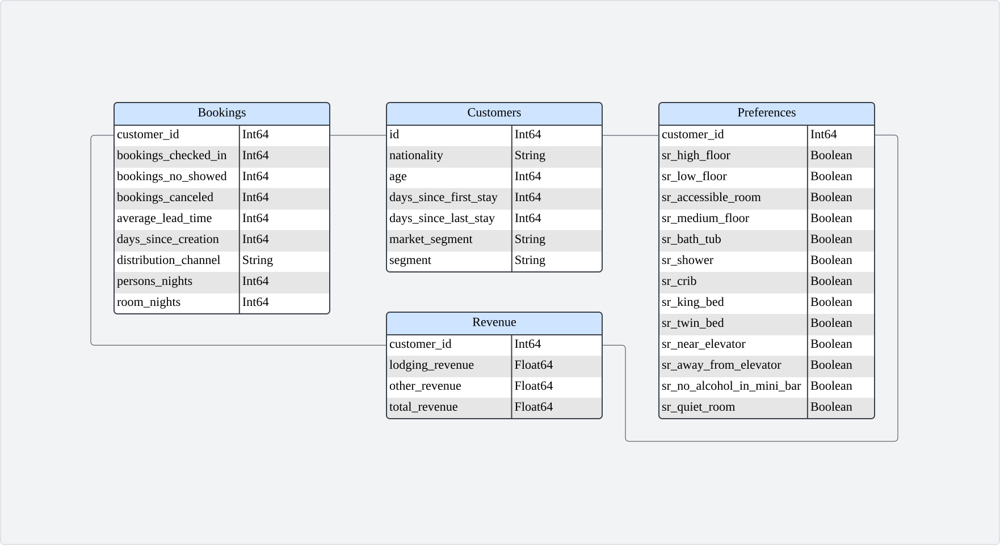

# Hotel Booking Analysis and Insights
---

## Table of Contents
1. [Project Background](#project-background)
2. [Executive Summary](#executive-summary)
3. [Analytical Insights](#analytical-insights)
    - [Revenue Trends](#revenue-trends)
    - [Customer Segmentation](#customer-segmentation)
    - [Room Preferences by Segment](#room-preferences-by-segment)
    - [Loyalty Program Performance](#loyalty-program-performance)
    - [Lead Time Patterns](#lead-time-patterns)
    - [Cancellation and No-Show Trends](#cancellation-and-no-show-trends)
4. [Recommendations](#recommendations)
5. [Assumptions and Caveats](#assumptions-and-caveats)

---
## Project Background

Lisbon Horizon Hotel, located in Lisbon, Portugal, serves a diverse clientele of both local and international guests. This project focuses on analyzing the hotel’s customer booking data to uncover patterns in customer behavior, preferences, and their impact on revenue. The insights generated aim to inform strategic decisions that enhance customer satisfaction and drive revenue growth.

The analysis is structured into three key phases:

- **Data Exploration and Cleaning**:  
  Using Python, I explored the dataset, cleaned and organized the data into structured tables, and created initial visualizations to better understand trends and patterns.

- **Business Insights with SQL**:  
  Leveraging SQL, I conducted more focused analyses to answer business-specific questions, complementing the Python-generated visuals with deeper data insights.

- **Actionable Recommendations**:  
  Based on the combined findings, I developed recommendations and strategies tailored to improve customer experience and optimize revenue for the hotel.

The dataset can be categorized into four main areas: **Customers, Bookings, Revenue, and Preferences**, with a total of **83,590 records**. Prior to analysis, comprehensive data checks were performed to ensure quality and familiarize myself with the dataset. Details of the data quality checks can be found [here](#).

---
